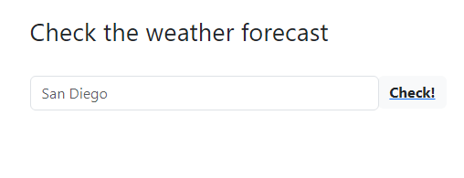
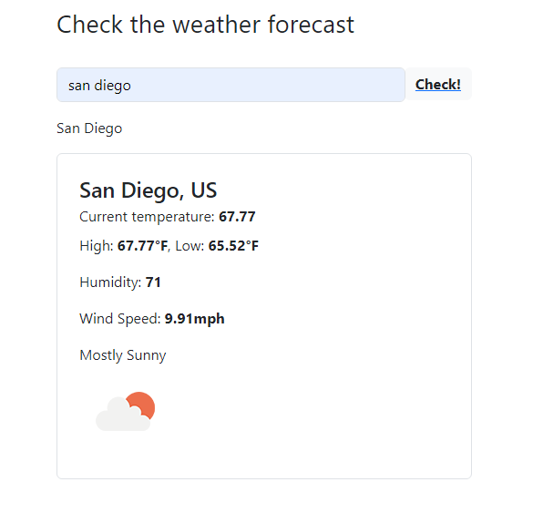
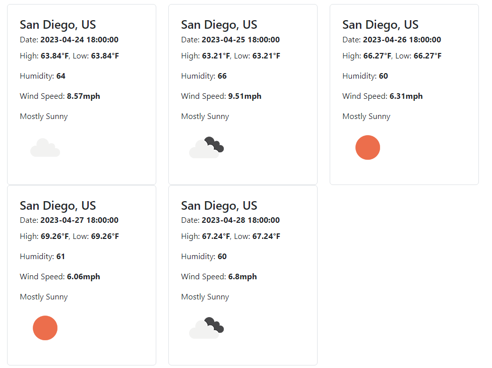
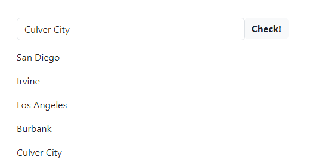

# weather-app

https://jakedish.github.io/weather-app/

This application uses OpenWeather's api to find weather conditions for a given city. 

Any city entered will provide the user with the current tempurature, highs and lows, humidity, wind speed, conditions and an icon associated with thos conditions.

Users will also see a 5-day future forecast, providing all the aforementioned information for the next 5 days.

Additionally, via the use of local storage data, any previously searched-for cities will display on screen. Clicking on any of them will once again show the weather info for that city.

